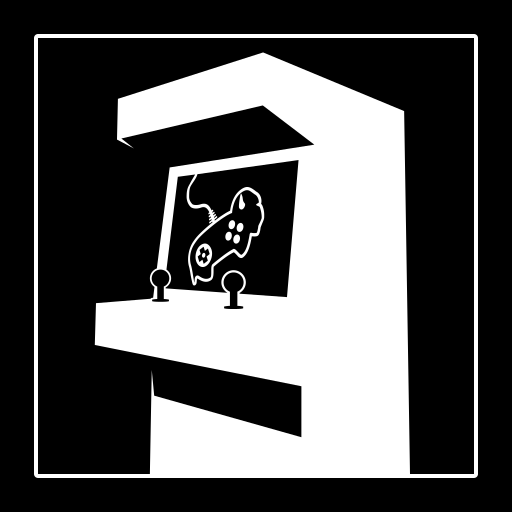

# BGS Cab Essentials
## A Godot Plugin and Demo Scene

The BGS Cab Essentials plugin for Godot is meant to make some things a bit easier when developing games for the BGS Arcade Cabinet located at Buffalo Game Space. When you install and enable the plugin in your project, you'll get:
- An autoload for keeping track of and redeeming credits, complete with signals your scripts can connect to for notification of credit availability and redemption
- Another autoload for autoquitting the game after a configurable amount of seconds with no user input
- An editor UI for handling cabinet-specific settings and assigning Input Map actions to the arcade cabinet controls

## Installation
Download or clone the repository and copy the "addons" folder into your Godot project. Then navigate to "Project > Project Settings > Plugins" and enable the plugin. Note that you may need to reload your project for the plugin to fully enable.

For more information on Godot plugins, see the official docs: [https://docs.godotengine.org/en/stable/tutorials/plugins/editor/installing_plugins.html]()

## Using the plugin
The plugin provides a UI for managing general BGS Arcade Cab options and associating Arcade Cab inputs with your project's input actions. It also provides autoloads to help handle general settings, automatically quitting the game back to the cabinet's game launcher, and managing game credits. For more information, refer to the UI tooltips, Input Actions help panel, and autoload documentation comments.

## Demo Scene
The project contains a demo scene that highlights most of the functionality offered by the plugin. The screen shows representations of player 1 and player 2 inputs, wthe mappings of which can be seen in the editor plugin UI "BGS Arcade Options > Input Actions". The bottom left of the screen show the current and required credits. Inserting enough credits will enable the "Press Start!" UI, which will disappear (along with the required credits) when Start is pressed. The bottom right shows the current time remaining before auto quit occurs. This timer will reset any time input events matching actions in the Input Map are pressed.
